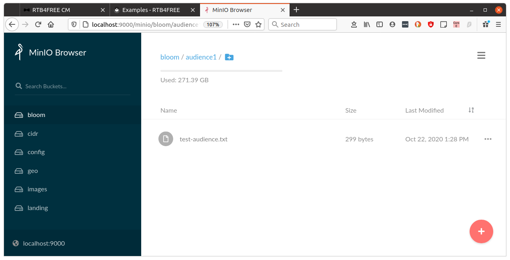
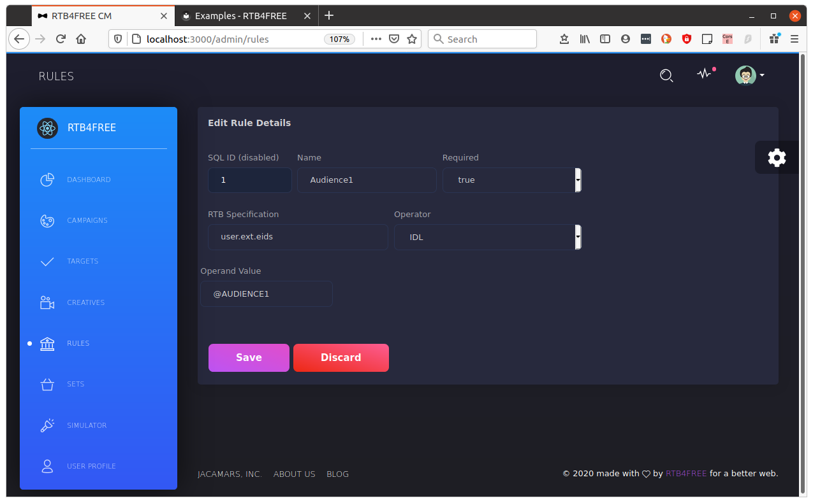
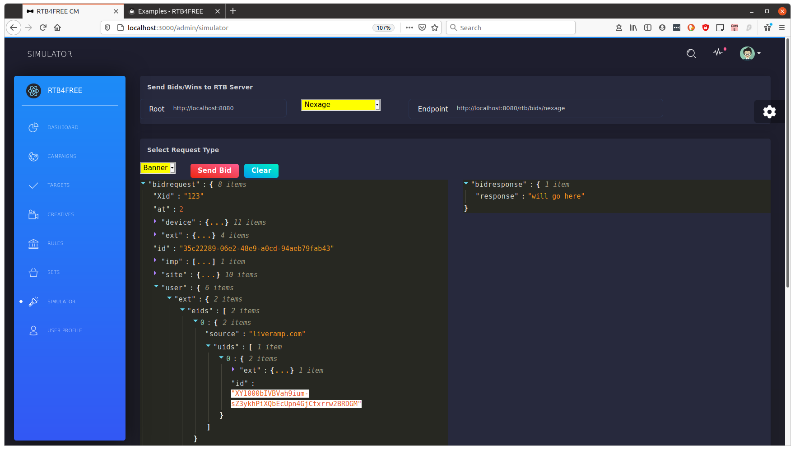
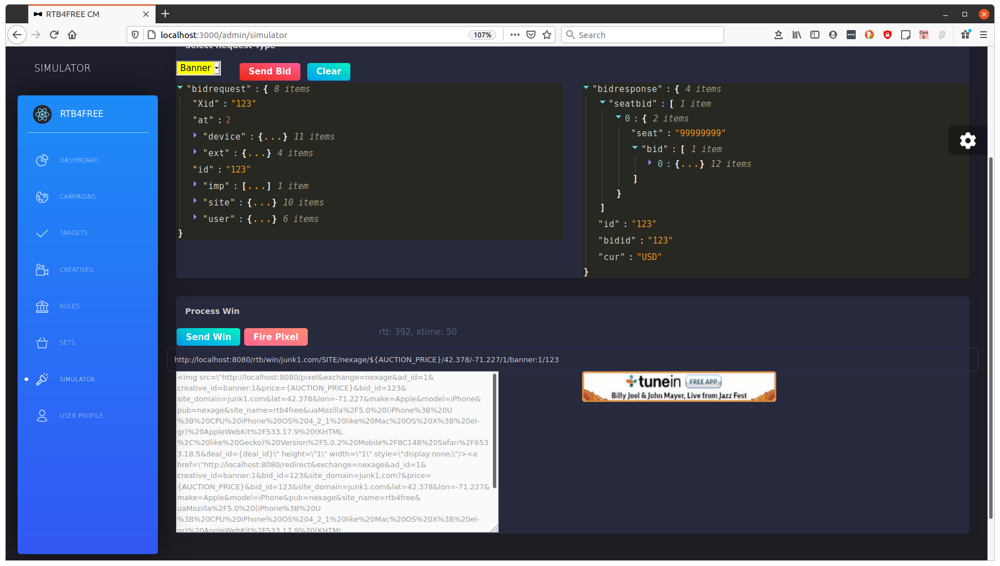
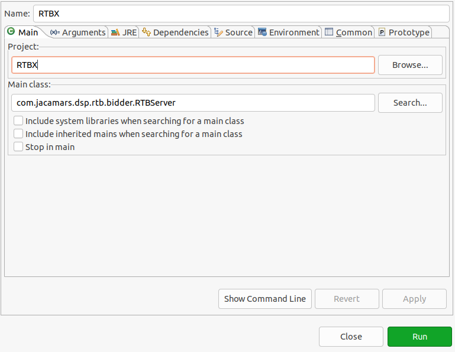
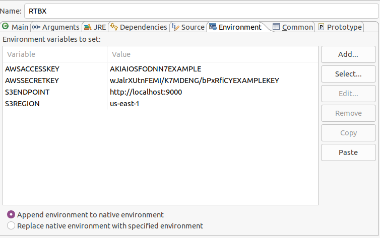
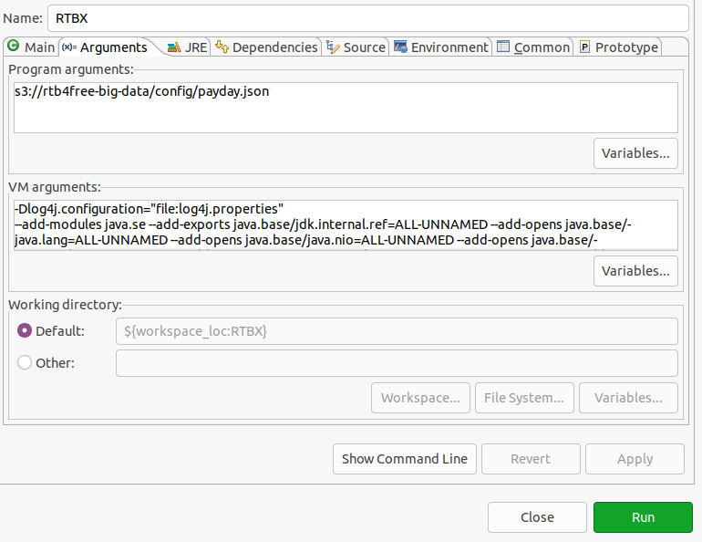

## Rules

### Testing for Liveramp
For exchanges supporting the Livetamp IDL ids (like Openx) you can use the IDL and NOT IDL operator
as a Rule and use it with campaigns and/or creatives. This example will show you how to set this up.

Here are some preresquisites:

- Bloom filter setup in in S3 or Minio and loaded into the Bidder.
- Rule defined to use the Bloom filter.
- RTB bid request that contains the user.ext.eids object with IDLs that are contained 
within the bloom filter.

The first step to using IDLs is to create a Bloom filter in either S3 or Minio. Here we will set up a 
trivial bloom filter for testing. The filter is simply a set of ids, with one id per line terminated
with a carriage return. Example:

```
XY1000bIVBVah9ium-sZ3ykhPiXQbEcUpn4GjCtxrrw2BRDGM
XY1000bIVBVah9ium-sZ3ykhPiXQbEcUpn4GjCtxrrw2CRDGM
XY1000bIVBVah9ium-sZ3ykhPiXQbEcUpn4GjCtxrrw2DRDGM
XY1000bIVBVah9ium-sZ3ykhPiXQbEcUpn4GjCtxrrw2ERDGM
XY1000bIVBVah9ium-sZ3ykhPiXQbEcUpn4GjCtxrrw2FRDGM
XY1000bIVBVah9ium-sZ3ykhPiXQbEcUpn4GjCtxrrw2GRDGM
```

This example only has 6 members, a real audience file would likely contain millions of entries.

The second step is to load the Bloom filter into S3 or Minio. For our example we load this into 
Minio at bucket bloom key audience1/test-audience.txt:



The third step is to load the Bloom filter into all the bidders that you have running.
You can load the Bloom filter at startup by adding it to the "lists" directive in payday.json
Example:

```
  "lists" : [ {
    "s3" : "geo/adxgeo.csv",
    "lazyload": true,
    "name" : "@ISO2-3",
    "type" : "ISO2"
  }, {
    "s3" : "cidr/METHBOT.txt",
    "name" : "@CIDR",
    "type" : "CIDR"
  }, {
    "s3" : "geo/adxgeo.csv",
    "name" : "@ADXGEO",
    "type" : "com.jacamars.dsp.rtb.exchanges.adx.AdxGeoCodes"
  }, {
    "s3" : "geo/zip_codes_states.csv",
    "name" : "@ZIPCODES",
    "type" : "com.jacamars.dsp.rtb.tools.LookingGlass"
  },{
    "s3" : "bloom/audience1/test-audience.txt",
    "lazyload": true,
    "name" : "@AUDIENCE1",
    "type" : "BLOOM",
    "size": 6
  }]
```
Notice the last entry. Here the Bloom filter is loaded at startup. A couple of caveats. First lazyload
is set to *true*. If this field is not present or is *false* then the Bidder will not be operational
until the Bloom filter loads. When this has millions of entries, this can take a long time. Second, you
must indicate how many records the Bloom filter contains. The filter cannot determine the number of
records in the S3 object for you. Third, you must give the Bloom filter a unique symbolic name, 
here we set it to @AUDIENCE1

Now we can set up the Rule in the campaign manager.



Selecting the *IDL* or *NOT IDL* operator will set the *RTB Specification*, you just need to add the
operand value, here we set it to @AUDIENCE1.

Now we use this in our sample banner creative.

[image](../images/audience3.png)

After saving the creative, make sure you also save the campaign that references this creative.

Now you are ready to test with the simulator. Notice the sample bid has the user.ext.eids expanded and we
have one id with the value of "XY1000bIVBVah9ium-sZ3ykhPiXQbEcUpn4GjCtxrrw2BRDGM":



Sending the bid will result in a bid reponse:



Changing the bid request to use an eid not in the Bloom filter will cause a no bid as the value will not be a member of the Bloom filter.

If your Bloom filter changes, or, you need to load a new Bloom filter you can update the symbol
without restarting the bidders. To do this, use the programmatic interface. In this example
we will load a new Bloom filter into all the bidders.

```
$python
Python 2.7.18 (default, Aug  4 2020, 11:16:42) 
[GCC 9.3.0] on linux2
Type "help", "copyright", "credits" or "license" for more information.
>>> import crosstalk;
>>> crosstalk.GetToken('rtb4free','ben.faul@rtb4free.com','zulu');
(200, 'OK')

>>> crosstalk.ListSymbols();
(200, 'OK')
{
    "catalog": [
        {
            "name": "@ZIPCODES", 
            "size": "42742", 
            "type": "com.jacamars.dsp.rtb.blocks.LookingGlass"
        }, 
        {
            "name": "@CIDR", 
            "size": "223", 
            "type": "com.jacamars.dsp.rtb.blocks.NavMap"
        }, 
        {
            "name": "@ISO2-3", 
            "size": "236", 
            "type": "com.jacamars.dsp.rtb.tools.IsoTwo2Iso3"
        }, 
        {
            "name": "@ADXGEO", 
            "size": "95033", 
            "type": "com.jacamars.dsp.rtb.exchanges.adx.AdxGeoCodes"
        }
    ], 
    "error": false, 
    "hazelcast": {
        "bidcache": 0, 
        "campaigns": 1, 
        "frequency": 0, 
        "miscCache": 1, 
        "videocache": 0, 
        "watch": 4
    }, 
    "timestamp": 1603484913145, 
    "token": "d01d4165-e7b6-4e8d-b970-5e48ca6b9d55", 
    "type": "ListBigData#"
}

>>>crosstalk.ConfigureAwsObject({"s3" : "bloom/audience1/test-audience.txt",
    "lazyload": True,
    "name" : "@AUDIENCE1",
    "type" : "BLOOM",
    "size": 6
  });

```

Now after executing the ConfigureAwsObject we can then list the symbols again and see the
symbol is present:

```
crosstalk.ListSymbols();
(200, 'OK')
{
    "catalog": [
        {
            "name": "@ZIPCODES", 
            "size": "42742", 
            "type": "com.jacamars.dsp.rtb.blocks.LookingGlass"
        }, 
        {
            "name": "@CIDR", 
            "size": "223", 
            "type": "com.jacamars.dsp.rtb.blocks.NavMap"
        }, 
        {
            "name": "@AUDIENCE1", 
            "size": "6", 
            "type": "com.jacamars.dsp.rtb.blocks.Bloom"
        }, 
        {
            "name": "@ISO2-3", 
            "size": "236", 
            "type": "com.jacamars.dsp.rtb.tools.IsoTwo2Iso3"
        }, 
        {
            "name": "@AUDIENCE1", 
            "size": "6", 
            "type": "com.jacamars.dsp.rtb.blocks.Bloom"
        }, 
        {
            "name": "@ADXGEO", 
            "size": "95033", 
            "type": "com.jacamars.dsp.rtb.exchanges.adx.AdxGeoCodes"
        }
    ], 
    "error": false, 
    "hazelcast": {
        "bidcache": 0, 
        "campaigns": 1, 
        "frequency": 0, 
        "miscCache": 2, 
        "videocache": 0, 
        "watch": 4
    }, 
    "timestamp": 1603490425956, 
    "token": "5e545c89-ca69-43e5-b77e-bd224585fcb8", 
    "type": "ListBigData#"
}
>>> 
```

##Using a Debugger

To work with the bidder using the Eclipse development environment is pretty easy. There are a 
couple of steps to take first.

### Start Kafka+Minio+Postgres+Zookeeper

Execute the docker-compose for this:

```
	$docker-compose -f justkafka.yml up -d
```

### Use Minio or S3

For object store, decide to use Minio or S3, this will determine what your Debug/Run parameters will look like.

### Using Minio


Modify the makefile to change all occurrances of "rtb4free-bigdata" to "rtb4free-bigdata-<youname>".

Modify Campaigns/payday.json to change all occurances of rtb4free-bigdata" to "rtb4free-bigdata-<youname>".

Copy all the file based objects with the minio target to Make:

```
	$make minio
```

Login to https://localhost:9000 to view the value in minio.

### Using S3

Modify the makefile to change all occurances of "rtb4free-bigdata" to "rtb4free-bigdata-<youname>".

Make a bucket in S3 named  ```rtb4free-bigdata-<yourname>```

Copy all the file based objects to S3 using make. You need your aws-access key, aws-secret key, and the region where
your bucket is. 

```
	make localS3 aws-access-key=youraccesskey aws-secret-key=yoursecretkey aws-region=theregion
```

### Set Up Debug Environment

On the main tab of Eclipse Run/Run Configurations set it up to look like this:




- On the environment tab of Eclipse Run/Run Configurations set the following variables (this is for Minio)



	To use S3, remove S3ENDPOINT variable and change the keys to your S3 keys.
	
- On the Arguments tab set up as follows:



The vm arguments are truncated on the view above, paste this into that window:
	
```
-Dlog4j.configuration="file:log4j.properties" 
--add-modules java.se --add-exports java.base/jdk.internal.ref=ALL-UNNAMED --add-opens java.base/java.lang=ALL-UNNAMED --add-opens java.base/java.nio=ALL-UNNAMED --add-opens java.base/sun.nio.ch=ALL-UNNAMED --add-opens java.management/sun.management=ALL-UNNAMED --add-opens jdk.management/com.sun.management.internal=ALL-UNNAMED
```


