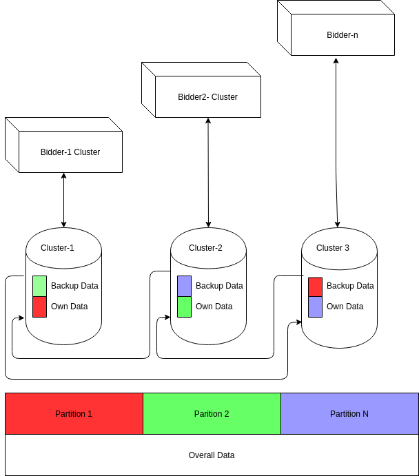
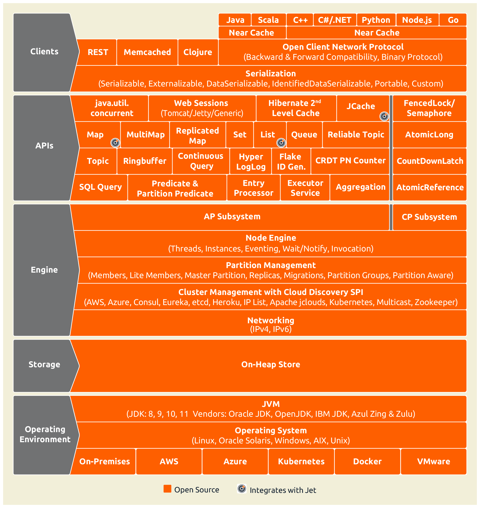
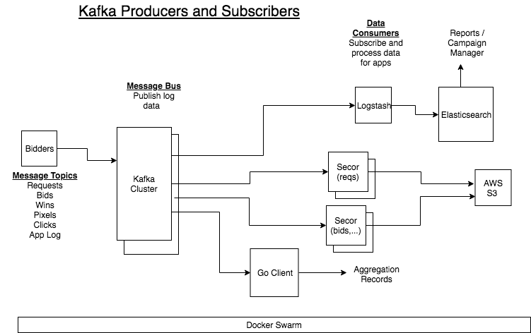
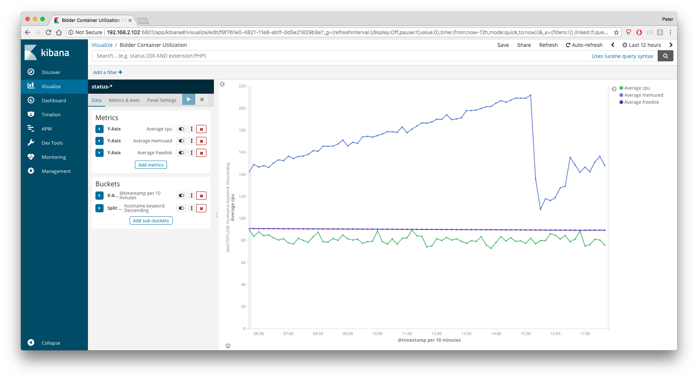
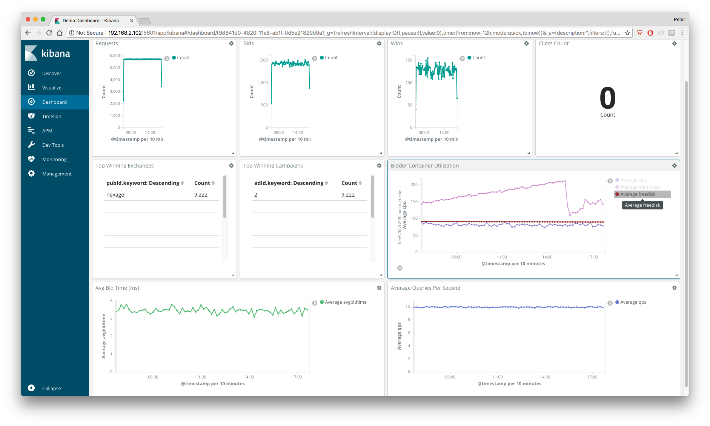
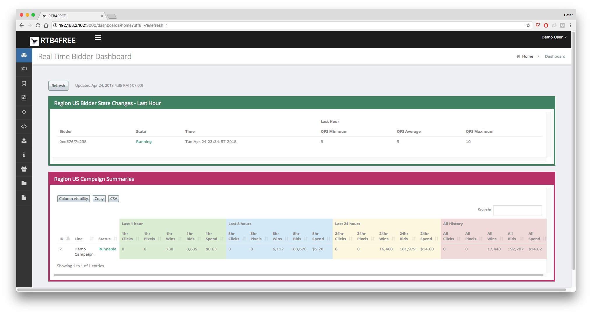

#Overview

##Bidding Engine

##IMDG

Many different technologies have been tried for maintaining state information between multiple bidders and the campaign manager: Redis and Aerospike being most notable. In the end tbese technologies brought
more bloat than value. What we really need is a cache between the bidders, and the campaign manager
that used familiar JAVA structures, like Maps. That's exactly what Hazelcast offers for us, with its "In Memory Data Grid" IMDG.

All of the shared data needed by the bidders, is stored in the IMDG. This includes all bids, wins, campaigns, and performance statistics. Furthermore, the bidders back each other's part of the DB up.

Hazelcast is a clustered, fault tolerant customer data platform, that utilizes the standard JAVA Maplike structures. Each bidder is a hazelcast member, and  ses the raft consensus protocol to 
create a fault tolerant database spread across clusters of datagrids. The total size of the database is limited by how many nodes you have running * the memory they have on board. Here's how the system is configured:

 

The overall data base is the sum of the clustered data. In addition, the nodes back each other up, up to a limit of  6 backup nodes for each cluster.

Using the Raft consensus protocol, one Bidder is the leader, and handles all Postgres initialization as well as budgeting. Any bidder can handle Campaign manager requests, but in the end they are all handled by the Lead bidder. If that Lead bidder, goes down, the other bidders will elect a new Leader. Budgeting and campaign management activities will not be interrupted. A campaign manager connected to a non-leader would likely not even notice the change in leaders.

The IMDG architecture is quite easy to work with. An overview of its features can be seen here:

 

Check out [Hazelcast](https://hazelcast.com){target=_blank} for more information

##Campaign Manager

The campaign manager of RTB4FREE is a REACT based application that will load from any bidder. The campaign manager communicates with the Postgres database to store campaign information. Loading campaigns from Postgres into the Hazelcast cache is done by the Leader bidder running a thread called "Crosstalk".

##Postgres Database

A postgres database stores all campaign definitions. The REACT-based campaign manager manipulates the postgres based tables using a well defined SQL schema, through a simple REST API to any bidder in an RTB4FREE cluster. But in reality, you can write
your own RTB4FREE campaign manager by defining the appropriate tables in the SQL database and issuing the simple REST based commands to reload campaigns.

The [schema for the database is located here](./Crosstalk-DB.pdf){target=_blank}

##Data Management Platform

The Data Management Platform (DMP), the third layer of the DSP. Layer 1 is the Bidder, Layer 2 is the Campaign Manager and Layer 3 is the Data management Platform.

###Features

- Integrated with the open source Elasticsearch, Logstash, Kibana (ELK) stack.
- Search and view RTB transaction log details for requests, bids, wins, pixels, clicks and costs.
- Search and view RTB application log details for bidder.
- Out-of-the-box dashboard reports in Kibana.
- Standard campaign metrics viewable in the Campaign Manager.
- Create custom reports using Kibana.
- Open architecture allows integration with your own data analytics infrastructure.
- Standard data backup and maintenance processes included.
- Scale up horizontally by deploying clusters for ELK and Kafka.

All bidder logs are sent to Kafka, as shown in the following diagram.

The system configuration depends on many parameters, including

- Bidder transaction rate (ie, queries per second).
- Performance of infrastructure.
- Available disk space.
- Historical data retention required.
- Granularity of data retained.

The RTB4FREE architecture can scale to support high data processing rates by horizontally scaling any of the following components:

- Bidder servers can be added as required to support additional SSP rates.
- Kafka, which is used for transport of data between bidders and data stores, can be clustered.
- Kafka consumers (such as Logstash) can be partitioned to share data transfer responsibilities.
- Elasticsearch can be clustered to accomodate increased data rates or storage requirements.

A detailed system configuration can be determined after understanding the detailed on the requirements.

###Kibana Reports
The RTB log records can be searched by selecting the corresponding index from the dropdown list, then entering a Lucene query in the seach input box.

The following record types can be selected.

- Requests. Requests for bids received from SSP exchanges.
- Bids. Bid responses to requests. The bidder will respond if a request matches a campaign.
- Wins. Winning bids from the exchange.
- Pixels. Impressions that have been served, typically signaled from a pixel image.
- Clicks. Click events.
- Postback Events. Additional user defined events, such as video events, mobile application loads, etc.
- Reasons. If a campaign has not bid on a request, the reason is logged here. This helps tune campaign paramters to increase win rates.
- RTB Logs. Bidder application log, used to determine health status of bidders.
- Stats. Bidder usage metrics, used to monitor bidder performance.
   

Kibana contains a report builder that let's you create various display widgets, such as charts, graphs, maps, heat maps, tag clouds, etc. A sample time series graph showing request rate over time is shown below:

You can combine various visualizations into a dashboard. This dashboard shows bidder transaction activity as well as bidder performance metrics in a single view.  Any data in the logs can be visualized with these tools.

###Campaign Manager Reports

Data logged into Elasticsearch can be made available to users of the Campaign Manger.  The following Campaign Manager view shows each campaign's usage using data extracted from Elasticsearch.

###Custom Data Stores
If you have special processing needs, you can build you own app to consume and process the data. An easy method is to build your own Kafka consumer and subscribe to the data topics you wish to process.

The open source secor project let's you read any of the RTB logs and store them in cloud storage, such as Amazon S3 or Google Cloud Storage. This option offers unlimited storage without worrying about disk space.  You can then download the data for offline data analysis using tools like Hadoop. 

If you need to process analytics in real time, a custom Kafka consumer can read the log stream and perform real-time analysis and store in your own database. 

##Deployments

For development and testing you can use docker-compose. For production use Kubernetes.

###Docker Compose

###Kubernetes 

###Kubernetes on AWS
