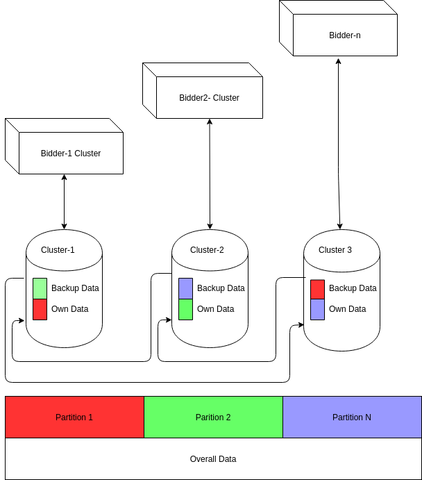
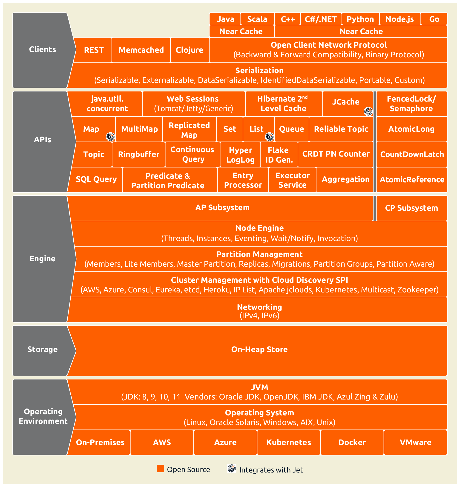

#Theory of Operation

The bidding engine is based on OpenRTB 2.8 and is written in JAVA running on the 1.11 Java virtual machine. It is a set of  dockerized containers employing the RTB bidder, Postgres, Kafka, Zookeeper, Minio and the ELK stack. Not included in the stack but a key part of the infrastructure is your own load balancer. Load your SSL certificates in your load balancer, not the bidder.

Internally the bidder is a JAVA program that receives RTB bid requests via HTTP (we use JETTY). The bid requests are converted to JSON objects (we use JACKSON for this). Bid requests are compared against campaigns stored in memory (we use Hazelcast IMap to store all the campaigns in shared memory). When requests come in the bids are selected against the campaigns, if one of the campaigns mathes then a bid is formed and stored in the shared memory (Hazelcast IMap) then the bid is trasmitted back to the
SSP. If you win the auction a win notification is sent to the bidder. When the ad is shown in the user's browser a pixel fire is received, or if it is a video, various video status messages may be sent to the bidder.

The bidder sends statistical samples of all bid requests to a Kafka channel for use by the ELK stack. Win notifications are also sent on a Kafka channel to the ELK stack so that the campaign's performance may be monitored and to perform budgeting. Pixel and video fires are also sent on a Kafka channel back to the ELK stack.

The campaign manager is a REACT application that interfaces wih the Postgres database through a simple API. It is possible to
interface your own campaign manager to the Postgres DB through a well defined schema. A few REST calls are needed to control loading and unloading campaigns, but it is all pretty straightforward. The bidders also act as web servers and you load the SPA
from any of the bidders, and also, can send the REST API calls to any running bidder. 

The campaign manager and the Postgres database are designed to support multi-tenancy.

The bidders form a cluster of bidders. The bidders share memory so that they see all the bids outstanding, all the campaigns, and all the frequency capping data. This is all handled with Hazelcast IMaps, using the In Memory Data Grid to store all the
relevant shared data.

Only one bidder runs a process called "Crosstalk". Crosstalk is the process that connects the Postgres database to the campaigns stored in the bidders. So while all bidders can read the database. All writeable operations go through the Lead bidder.

The lead bidder is elected using the Raft Consensus Protoco. Should the lead bidder go down, a new leader will be elected
automatically.

Budgeting is stored in the Postgres database, updated on the minute by Crosstalk, running in the Lead bidder. Once budget
limits have been reached, Crosstalk will unload those campaigns that have crossed the threshold. Remember, Crosstalk runs
in the Leader bidder.

All analytics are handled by the ELK stack. Kafka channels route bid requests, bids, wins, pixel fires, video fires, and win
notifications back to Logstash which loads the data into Elastic. Kibana is used to create views and dashboards.

The bidder loads CIDR lists, bloom filters, audience files, configuration parameters from either S3 or an
S3 compatible object store. By default, the RTB4FREE system uses *MINIO* to provide a S3 compatible object storage for use with the DSP.

##Bidding Engine
 

###IMDG

Many different technologies have been tried for maintaining state information between multiple bidders and the campaign manager: Redis and Aerospike being most notable. In the end tbese technologies brought
more bloat than value. What we really need is a cache between the bidders, and the campaign manager
that used familiar JAVA structures, like Maps. That's exactly what Hazelcast offers for us, with its "In Memory Data Grid" IMDG.

All of the shared data needed by the bidders, is stored in the IMDG. This includes all bids, wins, campaigns, and performance statistics. Furthermore, the bidders back each other's part of the DB up.

Hazelcast is a clustered, fault tolerant customer data platform, that utilizes the standard JAVA Maplike structures. Each bidder is a hazelcast member, and  ses the raft consensus protocol to 
create a fault tolerant database spread across clusters of datagrids. The total size of the database is limited by how many nodes you have running * the memory they have on board. Here's how the system is configured:

 

The overall data base is the sum of the clustered data. In addition, the nodes back each other up, up to a limit of  6 backup nodes for each cluster.

Using the Raft consensus protocol, one Bidder is the leader, and handles all Postgres initialization as well as budgeting. Any bidder can handle Campaign manager requests, but in the end they are all handled by the Lead bidder. If that Lead bidder, goes down, the other bidders will elect a new Leader. Budgeting and campaign management activities will not be interrupted. A campaign manager connected to a non-leader would likely not even notice the change in leaders.

The IMDG architecture is quite easy to work with. An overview of its features can be seen here:

 

Check out [Hazelcast](https://hazelcast.com){target=_blank} for more information

###Crosstalk
Crosstalk is a processing thread that runs inside the RTB bidder. This process has a REST API that allows you to create and manipulate campaigns, creatives, etc using HTTP POSTs (and stored n a Postgres database. Crosstalk also runs a budgeting process once a minute that connects to Elastic to retrieve campaign performance information and writes it to the IMDG and to the Postgres database. Note, Crosstalk runs in all the bidders, but budgeting is handled by the Leader bidder.

###API

###Frequency Capping
Frequency capping, typically tied to IP addresses (but not only way) is defined by the campaign manager and is stored in Postgres database and the IMDG. The frequency caps are created for each winning bid as per the campaign and these caps create counters in the IMDG and are visible to all bidders.

###Budgeting
Budgeting is estabished by the campaign manager and these budgets are stored in Postgres and in the IMDG, visible to all the Crosstalk threads within the bidders. Once a minute the Lead bidder's Crosstalk thread queries Elastic for the value of the current campaigns. Budgeting may be established for campaign and creative levels.

After Crosstalk retrieves the budget it looks to see if any running campaigns and/or creatives have exceeded their budgets. If so, the campaigns are unloaded (in the case of just a creative is at budget, the creative is unloaded).

##Campaign Manager

The campaign manager of RTB4FREE is a REACT based application that will load from any bidder. The campaign manager communicates with the Postgres database to store campaign information. Loading campaigns from Postgres into the Hazelcast cache is done by the Leader bidder running a thread called "Crosstalk".

###SPA
###Company/User Profiles
###Targets
###Creatives
###Capaigns
###Rules
###Simulator

##Postgres Database
###Overview
A Postgres database stores all campaign definitions. Note the appropriate  tables are partitioned by customer_id to support
multi-tenant operations.

The REACT-based campaign manager manipulates the postgres based tables using a well defined SQL schema, through a simple REST API to any bidder in an RTB4FREE cluster. But in reality, you can write
your own RTB4FREE campaign manager by accessing and updating the appropriate tables in the SQL database and issuing the simple REST based commands to reload campaigns.

To create a viable campaign you will have one row for a campaign in the “campaigns” table.  There will be a single row in the “targets” table for each campaign. The target_id field in the campaigns table is the value of the id in the targets table.

In either, or both “banners” table and “banner_videos” table there will be at least one row in the combination of both of these tables of a campaign_id field equal to the id in the campaigns table.

In the “campaign_rtb_standards” table there will be zero or more rows with the campaign_id field equal to the id field in the “campaigns” table. The rtb_standard_id field is equal to the id field in the “rtb_standards” table. This is how custom constraints are attached at the campaign level.

In the “banner_rtb_standards” table there will be zero or more rows with the campaign_id field equal to the id field in the “banners” table. The rtb_standard_id field is equal to the id field in the “rtb_standards” table. This is how custom constraints are attached at the banner creative level.

In the “video_rtb_standards” table there will be zero or more rows with the video_id field equal to the id field in the “banners_video” table. The rtb_standards_id field is equal to the id field in the “rtb_standards” table. This is how custom constraints are attached at the video creative level.

###ERD
When in doubt, look at a campaign created with the RTB4FREE campaign manager to see what the corresponding values look like.
The [schema for the database is located here](./Crosstalk-DB.pdf){target=_blank}

##MINIO
Minio is a cloud storage server compatible wth Amazon S3. Using Minio, RTB4FREE can load large data files
such as Bloom filters, CIDR lists and configuation files from a central location. By default the RTB4FREE
deployment uses the directory /tmp/S3 to mount the /data volume of MINIO's container. This host directory is used to store and retrieve files. For operational use you might want to 
deploy to a different location to keep dta persistent over reboots.

Note, you can replace MINIO with Amazon S3. However, if you are not using S3, MINIO will provide the capability needed by the RTB4FREE stack.

##Data Management Platform

The Data Management Platform (DMP), the third layer of the DSP. Layer 1 is the Bidder, Layer 2 is the Campaign Manager and Layer 3 is the Data management Platform.

