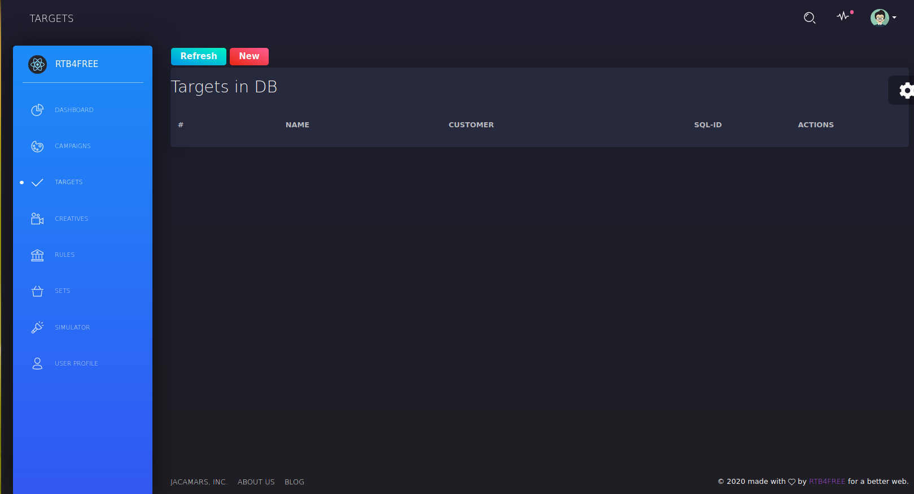
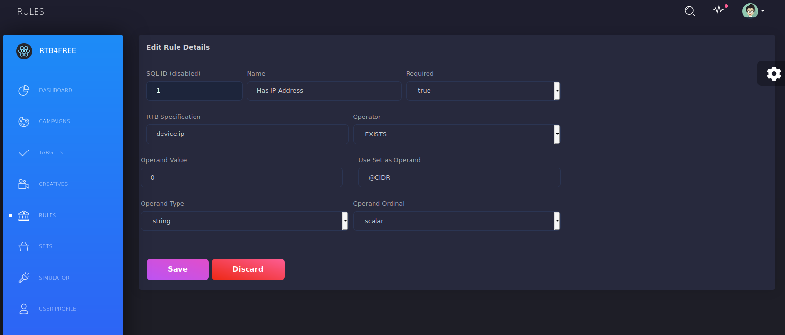

##Overview
The Campaign Manager, the second layer of the DSP. Layer 1 is the Bidder, Layer 2 is the Campaign Manager and Layer 3 is the Data Management Platform.

Features at a glance:

- REACT Web based.
- Supports Banner, Video, Audio and Native Ads.
- Provides Day Parting service.
- Employs Open, Hourly, Daily and Total budgeting.
- Easy to use targetting.
- Build your own specialized rules if standard targetting is not sufficient.</li>
- Docker Microservices Architecture. Built with REACT.
- Multi-tenant. 

A campaign is the offering of one or more creatives over a certain time period, and with specific targets. We use the
term target to mean constraining rules that filter out those id requests that match your target market. When we say
relative we mean a banner ad, a video or a native ad. Additionally, you can use the Campaign Manager to review the
the running status of your campaign, and to start and stop campaigns.</p>

The process to create a new campaign is:

- Select the Campaigns icon and define the basic campaign parameters Save the campaign.
- Select the Banners or Video icon and define the creative parameters. 
- Select the campaign you created in step 1 to assign the creative to your campaign. Save the creative.
- Select the Target icon and define the target parameters. Save the target.
- Return to the Campaign edit page, and select the Target that you created. 
- Saving the Campaign will load it in the bidder.

##Accessing
To access the RTB4FREE Campaign Manager point your browser to http://localhost:8100/campaigns. The following screen should appear:


On initial build, this user ben.faul@rtb4free.com is already configured. Use the following values to login the first time.

- Org: This should be rtb4free. This is the company id of the user, the database support multi-tenancy so multiple orgs can be supported.
- User: ben.faul@rtb4free.com - This is the user already configured.
- Password: zulu - This is the initial password.
- Server: localhost:7379. Point this to any bidder at this port id. This is the API port.

##Dashboard
On initially logging in , you will be at the dashboard, like this:


The *Instances* show you how many bidders are running in this cluster. In this case only 1.

The *Running Campaigns* shows how many campaigns are loaded into the cluster. In this case there are none.

##Bidding
To send bids to the SSPs you need viable campaigns. A campaign is the offering of one or more creatives over a certain time period, and with specific targets. We use the term target to mean common constraints that filter out those bid requests to 
match your target market. When we say creative we mean a banner ad, a video or a native ad. 

##Campaigns
Pressing the Campaign icon on the blue dashboard will bring up the following screen that shows existing campaigns, in this case
there are no campaigns yet:


Pressing the red *New* button will allow us to create a new campaign:


And scrolling down a little:


The following fields are set forth with their meanings:

- SQL idhis is a db id, it is nt editable.
- Name This is the name of the campaign. It must be a unique name. *REQUIRED*.
- Ad Domain: This is the advertisers root domain. *REQUIRED*
- Fraud Suppression: This indicates if built in fraud suppression is used, but no effect if not enabled at the system level.
- Bidder status: Whether this is an actve campaign. Set to online to bid (but will only go online if it is a viable campaign).
- Creatives: This list will show what creatives are assigned to this campaign. *Not viable without creatives*
- Start: The start date and time for campaign activation *REQUIRED*
- Stop: The stop time of campaign activation. *REQUIRED*
- Spend rate: Regardless of budget, maximum spend rate per minute of a campaign. Setting nothing or 0 means no limit.
- Bidding Region: Choose a region where this campaign is to be bid in, *REQURED*
- Exchanges: Choose none or multiple exchanges (if they are connected). Selecting none will enable all.
- Target: Choose a target to attach to the campaign *Not viable without a target*
- Rules: Choose 0 or more defined rules to attach to the campaign. A rule is a specialized constraint.
- Total Budget: Total amount of US dollars to allocate to this campaign. Setting 0 means no budget.
- Daily Budget: Amount campaign is to spend per day. Setting 0 means no daily constraint.
- Hourly Budget: Amount campaugn is to spend per hour. Setting 0 means no set hourly constraint.
- Frequency Specification: Defines the RTB spec JSON name to key on. For example *device.ip* 
- Dayparting: Sets a calendar of when to spend by days of the week and by time.

Push the purple *SAVE* button to save the campaign. The following is a sample campaign.

Creating a campaign named "Test-Campaign-1" with no targets or creatives creates the campaign byt it will be offline as indicated by the grey stripe:


Pressing the blue *Report* button will tell you why the campaign is offline. In this case "No attached creatives. Marked offline" is displayed in the popup after *Report* is pressed.

Fields with "*" indicate a required field. Most of the fields are self-explanatory, with the exception of Region, and Rules.
A Region is a bidding region. It is the name given to a group of bidders controlled by Crosstalk. Only one Region can
be specified. If you are set up to bid in the US, then use US as the region. If in Asia, use AP, and if in Europe use EU.

Rules are specific constraints applied to the campaign gathered from the bid requests and are discussed further 
in the documentation.

Once you have a campaign created, you can add Banner and Video, Audio and Native Ad creatives.

##Targets
The next step is to create a target. Pressing the *Targets* icon in the blue field causes the following to appear:



Pressing the red *New* button will cause the new target window to appear:


Here is a description of the fields and what they mean:

- SQL ID: The database key id, not editable.
- Ad id: This is the target's name *REQUIRED*.
- Domain Values: CCC.
- Use Big Data Set for Domain Values.
- Type: Select WHITELIST to make sure the domain values are present, otherwise BLACKLIST to exclude from bidding the value is present.
- Country: Put the country names in by 3 character ISO names. With nothing specified all countries are valid.
- Geo Latitiude: Put the GPS latitude here to create a fence. None means no fence.
- Geo Longitude: Put the GPS longitude here to create a fence. None meand no fence.
- Geo Range: Inclusive circle in Km around lat/lon for the fence. Note, for multiple fences use a rule.
- Carrier: Name of the carrier to key on. *Case sensitive* Comma separated list.
- Operating System: Name of OS. *Case Sensitive* Comma separated list.
- Make: A single make is allowed.
- Model: Models supported, one per line.
- Device types: Choose one or more. Choosing none selects all.
- IAB Whitelist: Looking for these IAB categories in the bid request. Multi select. Choose none to accept any
- IAB Blacklist: Exluding these IAB categories. Multi select. Choose none to not exclude them.

Select the purple *Save* to save the Target. After putting *USA* in the country field and pressing Save we see this result:


Returning back to Campaigns, and editing "Test-campaign-1" we can select *My New Target* for it. 


Now, all we need to make this a viable campaign is to attach a creative.

##Creatives
A creative is the actual thing the user will see on their device. This is your actual advertisement. Choosing the *Creatives* icon on the blue panel brings up the following screen:


### Banner
A Banner creative is a simple graphical image, such as a gif, png, or jpg picture.

The banners are accessed via the *New* button above the Banners field . Example after pressing new:


And scrolling down to the end:


The fields and their valus are described below:

- SQL ID: Not editable
- Name: Name of this creative *REQUIRED*
- ECPM/Price: Price per 1000 *REQUIRED*
- App/Site/Both: Whether this is aonly for apps, websites or both. *REQUIRED*
- Match Size: Any/Specified/W-H Ranges/W-H List: Choose one to set your sizes you are looking for *REQUIRED*
- Deals: No Deal/Private Only/Private Preferred: Which deal strategy if any. *REQUIRED*
- Content-Type: The type of the banner *REQUIRED*
- The URL of the image *REQURED*.
- Click Through URL: Where to go on the Click *REQUIRED*
- HTML Template: Actual HTML code of the tag. *REQUIRED*
- Campaign: Shows the attached campaign.
- Creative's Categories: Identifies the categories that match this ad. *REQUIRED*
- Creatices Atrributes: Multi selection of the attributes of the ad. *REQUIRED*
- Specialty Exchange Attributes. Press the button to input the special key fields required by the respective exchanges. *REQUIRED FOR THOSE EXCANGES* Ignore if these exchanges don't apply.
- Start date creative is active. *REQURED*
- End Date creative is active. *REQUIRED*
- Rules: Select any rules you want attched to this creative.
- Total Budget: Total amount of US dollars to allocate to this campaign. Setting 0 means no budget.
- Daily Budget: Amount campaign is to spend per day. Setting 0 means no daily constraint.
- Hourly Budget: Amount campaugn is to spend per hour. Setting 0 means no set hourly constraint.

Select save to save the creative to the database. Your screen wll show the new creative:


Now with the creative, we can attach it to the campaign. Going back to Campaigns panel and editing *Test-campaign-1* we can
now select *Test Banner* in the *Creatives* section, and also select *runnable* for *Bidder Status*.


Pressing *Save* will bring up the Campaigns status window, the status line should turn *green* because the bidders have now been loaded with a viable campaign.


### Video
A video creative is a Video that plays in a VAST player. The video creative is accessed via the the
"Videos" panel. An example is shown below:

After clicking the *Creatives* icon on the blue field, you will be presented with a screen that looks like this:


Click the *New* button and a new editor window for Video creatives will be presented to you like so:


And scrolling down a little further:


The fields and what they mean are shown below:

- SQL ID: Not editable
- Name: Name of this creative *REQUIRED*
- ECPM/Price: Price per 1000 *REQUIRED*
- App/Site/Both: Whether this is aonly for apps, websites or both. *REQUIRED*
- Match Size: Any/Specified/W-H Ranges/W-H List: Choose one to set your sizes you are looking for *REQUIRED*
- Deals: No Deal/Private Only/Private Preferred: Which deal strategy if any. *REQUIRED*
- Content-Type: The type of the banner *REQUIRED*
- The URL of the image *REQURED*.
- Mime Type: Select the technology he video is. *REQUIRED*
- Linearity: Use 1 or 2. *REQUIRED*
- Duration: The duration in seconds. *REQUIRED*
- VAST Video Protocol: The protocol identifier *REQUIRED*
- Bit Rate: The minimum bits per second rate to support in the player. *REQUIRED*
- Creative's Categories: Identifies the categories that match this ad. *REQUIRED*
- Creaticvs Atrributes: Multi selection of the attributes of the ad. *REQUIRED*
- Outgoing File: The VAST Tag output. *REQUIRED*.
- Specialty Exchange Attributes. Press the button to input the special key fields required by the respective exchanges. *REQUIRED FOR THOSE EXCANGES* Ignore if these exchanges don't apply.
- Start date creative is active. *REQURED*
- End Date creative is active. *REQUIRED*
- Rules: Select any rules you want attched to this creative.
- Total Budget: Total amount of US dollars to allocate to this campaign. Setting 0 means no budget.
- Daily Budget: Amount campaign is to spend per day. Setting 0 means no daily constraint.
- Hourly Budget: Amount campaugn is to spend per hour. Setting 0 means no set hourly constraint.

Select save to save the creative to the database. Your screen wll show the new creative:


Don't forget to go back to the *Campaigns* section and add your creative to the system.


### Audio
An audio creative is an audio that plays in a VAST player. The audio creative is accessed via the the
"Audios" panel. An example is shown below:

After clicking the *Creatives* icon on the blue field, you will be presented with a screen that looks like this:


Click the *New* button for the *Audio* section and a new editor window for Audio creatives will be presented to you like so:


And scrolling down a little further:


The fields and what they mean are shown below:

- SQL ID: Not editable
- Name: Name of this creative *REQUIRED*
- ECPM/Price: Price per 1000 *REQUIRED*
- App/Site/Both: Whether this is aonly for apps, websites or both. *REQUIRED*
- Match Size: Any/Specified/W-H Ranges/W-H List: Choose one to set your sizes you are looking for *REQUIRED*
- Deals: No Deal/Private Only/Private Preferred: Which deal strategy if any. *REQUIRED*
- Content Type: Select the technology he video is. *REQUIRED*
- Duration: The duration in seconds. *REQUIRED*
- Start Delay: How many seconds before the audio plays. *REQUIRED*
- Bitrate: The desired bit rate. *REQUIRED*
- Supported Protocol: Select the type of player needed. *REQURED*
- Supported API: Select the API.
- DAAST FILE: The VAST/DAAST tag specification.
- Companion: A companion banner to be displayed while the audio plays.
- Creatives Atrributes: Multi selection of the attributes of the ad. *REQUIRED*
- Outgoing File: The VAST Tag output. *REQUIRED*.
- Specialty Exchange Attributes. Press the button to input the special key fields required by the respective exchanges. *REQUIRED FOR THOSE EXCANGES* Ignore if these exchanges don't apply.
- Start date creative is active. *REQURED*
- End Date creative is active. *REQUIRED*
- Rules: Select any rules you want attched to this creative.
- Total Budget: Total amount of US dollars to allocate to this campaign. Setting 0 means no budget.
- Daily Budget: Amount campaign is to spend per day. Setting 0 means no daily constraint.
- Hourly Budget: Amount campaugn is to spend per hour. Setting 0 means no set hourly constraint.

Select save to save the creative to the database. Your screen will show the new creative:


Don't forget to go back to the *Campaigns* section and add your creative to the system.


### Native

##Rules
Selection of a campaign, and the creatives within a campaign is a function of a list of
"rules" that are applied to attributes of the incoming bid request. Each rule is applied
in turn to the bid request. Each rule returns a value of True or False. A value of True
for making a bid. If at any time, a rule evaluates to false the Campaign/creative is not
a candidate for making a bid and rule processing for that Campaign/creative is terminated.

A rule is simply a question applied to the values on the bid request against a constraint defined
in the Campaign or Creative. The question is framed such that the response will be True or False. An 
nformal rule might be "Is user.id equal to "XXX", or "Is user.id contained in the set "my_cookies".

A series of rules are used to "filter" the Bid Request against the definition of the campaign.

The Rule is a JSON object within an array object of the Campaign definition called "attributes". So, from here on out, we will use the term "constraint" to mean a rule defined as a JSON object in the list of "attributes".

 A creative, which is a sub-object of the campaign can also have its own array of attributes. So the rules defined at the campaign level apply to all creatives, while the constraints within a creative apply only to that creative.
 


A rich set of operators is provided for the RTB to work with. This list includes all
the actions we have encountered over the past several years.


- EQUALS - Tests bid request scalar being equal to another scalar
- NOT_EQUALS - Tests bid request scalar != to another scalar
- LESS_THAN - Tests bid request scalar < than another scalar
- LESS_THAN_EQUALS - Tests bid request scalar <= another scalar
- GREATER_THAN - Tests bid request scalar > another scalar
- GREATER_THAN_EQUALS - Tests bid request scalar >= another scalar
- MEMBER - Tests bid request scalar is a member of a set
- NOT_MEMBER - Tests bid request scalar not a member of a set
- INTERSECTS - Tests bid request array intersects another set and is not empty set.
- NOT_INTERSECTS Tests bid request array intersected with another set is an empty set
- DOMAIN - Tests bid request scalar is between 2 numbers (defined in an array)
- NOT_DOMAIN - Tests bid request scalar is not between 2 numbers (defined in an array)
- STRINGIN - Tests a string is a substring of the string in the bid request object
- NOT_STRINGIN - Tests a string is not a substring of the string in the bid request object.
- REGEX - Tests for a match of a regular expression against a string in the bid request object.
- NOT_REGEX - Tests for the non-match of a regular expression against a string in the bid request object.
- EXISTS - Tests that an object is in existance within the bid request.</li>
- NOT_EXISTS - Tests that an object does not exist within the bid request object
- INRANGE - Tests that the lat/lon of a geo object in the bid request is within a certain number of Km from a specified point
- NOT_INRANGE Tests that the lat/lon of a geo object in the bid request is at least a certain number of km from a specified point.

You can create rules to operate on any part of the RTB object. The following is an example. 

Select the *Rules* icon on the left in the blue area and the following screen will appear:


Select the the red *New* button to go to the rules editor:


The following is an explanation of the fields:

- SQL ID: Non-editable field.
- Name: The name of the rule. *REQUIRED*
- Required: Set to true if the RTB bid request must have the object we are looking for.
- RTB Specification: The name of the object you are going to query in the JSON bid request. *REQUIRED*
- Operator: One of the operators from above, like DOMAIN, or LESS THAN, etc. *REQUIRED*
- Operand Value: The value you are looking for. *REQUIRED*
- Use Set as Operand: Use a preloaded SET or Bloomfilter as the Operand. (See Set)
- Operand Type: The type of the operand value, e.g. integer. *REQUIRED*
- Operand Ordinal: Whether the operand is an array or a scalar. *REQUIRED*

In this example, we make sure the device.ip attribute is present in the RTB bid request:


In this rule, Operand value, Use Set as Operand, Operand Type and Operand Ordinal are irrelevant.


##Sets
This view, avaliable from the *SETS* icon on the left hand navigation pane provides a view into the configuration
of audience files, bloom filters and CIDR maps loaded from S3/Minio into the bidder memory. 

This view will also provide you with a view into the IMDG cache and allow you to query the cache.

Finally, the Macros view will show you the macros you can utilize in your campaigns.

After pressing the *SETS* icon on the left side navigation you will see a listing of the views like this:


And scrolling down a little....


###Sets/Navmap/CIDR/Bloom Filters
The *Sets/Navmap/CIDR/Bloom Filters* view provides you with a list of all the available "sets" in the bidder memory.
These are preloaded when the bidder is loaded and is stored in the *lists* object in the S3/Minio object "config/payday.json". Example:

```
 "lists" : [ {
    "s3" : "geo/adxgeo.csv",
    "name" : "@ISO2-3",
    "type" : "ISO2"
  }, {
    "s3" : "cidr/METHBOT.txt",
    "name" : "@CIDR",
    "type" : "CIDR"
  }, {
    "s3" : "geo/adxgeo.csv",
    "name" : "@ADXGEO",
    "type" : "com.jacamars.dsp.rtb.exchanges.adx.AdxGeoCodes"
  }, {
    "s3" : "geo/zip_codes_states.csv",
    "name" : "@ZIPCODES",
    "type" : "com.jacamars.dsp.rtb.tools.LookingGlass"
  } ]
```

The symbol name, e.g. *@ZIPCODES* is the name you can use in a *Rule* to interrogate some part of the RTB bid to
produce a boolean value. For example, @CIDR@ is shown as a NavMap. In this case you can set up a rule and 
test if device.ip's value of a bid request is contained within this CIDR list. This will return true.

Example:




Note, @ADXGEO and @ISO2-3 are used internally by the bidders and are not generally user SETS. @ISO2-3 maps 2
character country codes to ISO3 country codes. @ADXGEO maps UN city/country codes to familiar city names and
ISO3 country codes.

###In Memory Data Grid
This view allows you you to examine the contents of the bidder's shared memory context. The *bidcache* is the
current bids that are outstanding without WIN notification. The *videocache* stores all the cached video VAST objects. The *miscCache* stores the miscellaneous bits used by the bidder.

###Macros
The *Macros* view shows you all the macro names you can use in your creatives. For example, using *{event_url}* in
your creative will expand to *http://localhost:8080/track*.

Note, some of these are system provided macros. You can create your own macros by adding them to the *app.systemMacros* object in the S3/Minio object config/payday.json:

```
 "app" : {
    "concurrency" : "1",
    "systemMacros": {
    	"{rtb_pixel}": "",
    	"{rtb_click}": "<a href='$EXTERNAL/redirect?url=_REDIRECT_URL_?EXCHANGE={exchange}&EXTERNAL=$EXTERNAL&AD_ID={ad_id}&CREATIVE_ID={creative_id}&BID_ID={bid_id}' target='_blank' rel='noopener'>",
    	"{/rtb_click}": "</a>"
 
    },
```

You can see, {rtb_pixel}, {rtb_click} and {/rtb_click} are provided by the systemMacros. Of course, if you use
{rtb_click}, please close your creative with {/rtb_click}

##Simulator
Pressing the *SIMULATOR* icon on the left navigation pane will bring up the simulator view, which looks like:


The top pane has the title *Send Bids/Wins to RTB Server*. The *Root* input will allow you to change the URL prefix to use. The next is the SSP selector, set to *Nexage* by default. The read-only *Endpoint* shows where the bid
request will be sent.

The next pane, title *Select Request Type* allows you to choose the bid type (Banner, Video, Audio, or Native). It also has 2 JSON pane windows. The left hand side is the editable window and allows you to make changes in the request. The right hand pane shows the response JSON.

Pressing the red *Send Bid* button causes the bid request to sent to the *Endpoint* you selected. You will receive a response, depending on whether a campaign is available, and will look something like:


Now a new pane opens up for *Process Win* Here the win URL is shown as well as the ADM field. Also a new red *Fire Pixel* button appears. Pressing the *Send Win* causes the creative to be served. If the creative can be displayed, it will on the right hand side, like below:


Pressing the red *Fire Pixel* simulates a pixel fire, and will send that pixel to the bidder, simulating the creative being loaded in the user's page. Note this pixel fire will be sent with debug=true, so the bidder handling the pixel fire will print debug information on its console.

If the Pixel fire works you will get a popup saying "OK, Pixel Fired". If not you will get an error message popup.

##User Profile
Selecting *USER PROFILE* from the left hand navigation pane will bring up the logged in user profile screen Depending
n whether you are a super user, or a super user of the customer_id *rtb4free* you will be presented with additional buttons to administer other users and administer other companies.

The view looks like:


###User Profile
The *User Profile* is the profile of the logged in user. On the left hand side are the components of the profile. Note, Company name and company id are not editable. The username and password fields are required.

The right hand side shows a picture and some informative text. 

If you are a superuser then *Admin Users* button will be available. If you are a super user and the customer-id is *rtb4free*, then *Admin Companies* will
be available.

###Admin Users
Pressing the *Admin Users* button at the top brings up the Admin Users pane, which looks like:


If your super-user login is of customer-id *rtb4free* then you can edit and add user ids for any organization. If not of the *rtb4free* login group you will be able to edit only your own organization's user ids.


###Admin Companies
Pressing the *Admin Companies* button at the top brings up the Admin Companies pane.


If you are *rtb4free* super-user, you will be presented with all the companies defined. If you are not of organization *rtb4free* you will
only be able to edit your own company profile.

If you are *rtb4free* org super-user, you can use the *+Company* button and create a new company. Pressing this button will bring up a Dialog and ask you to enter a new *Company Id*. 


This field is used to set the organization key for the company. Once you set it, it can't be changed. Add the new id, and his save, a new Company will appear. 


Add the *Company Name* (required) and fill in the other fields. You must add a Budget, or the new organization will not be able to bid. Then hit the *Save* button. After making a new Company, you will need to make at least one super-user user-id for this company as well, using the *Admin Users* button.

If you are *rtbfree* organization, you can update the budget directly. Just add the value into budget and hit the *Update* button. Otherwise the Update button will not be available. In that case, hit the *Budget* button and you can add budget using a Paypal portal.

	
