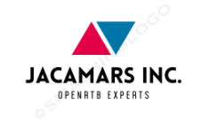

 

#RTB4FREE Demand Side Platform

A complete, open source advertising Demand Side Platform (DSP). Completely "Dockerized" and uses well known open source tools. Contains 3 major components:

- OpenRTB Real Time Bidder: Written in Java 1.11 and implements RTB v 2.8.
- Campaign Manager: React based campaign manager for controlling campaigns. Uses Postgres for database operations.
- Data Management Platform: A DMP developed with Elastic Search, Logstash, and Kibana.

##OpenRTB Engine 2.8

OPENRTB Bidding engine (2.8) in Java 1.8. Supports banner, native, audio and video ads. Try the stand-alone bidder in your environment using Docker-Compose in your environment:

##Campaign Manager

Try the React-based stand-alone campaign manager in your environment using Docker-Compose: 
						
##Data Management Platform 

Data Management Platform (DMP) provides campaign and system analytics with the ELK Stack, Try the stand-alone DMP in your environment using Docker-Compose:

##Kubernetes Deployments

Deploy your DSP in your environment, or in Amazon Web Services (AWS).

E-mail: info@rtb4free.com